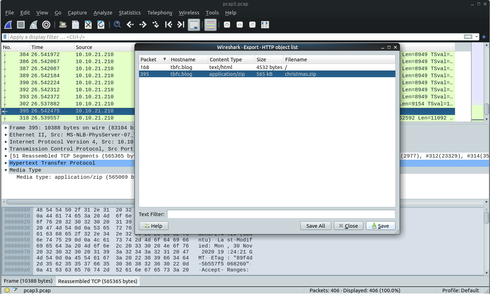

# The Grinch Really Did Steal Christmas

## Video



## Resources

| Filter | Description | Example |
| :--- | :--- | :--- |
| ip.src | Show all packets that originate from the specified IP address | `ip.src == 192.168.1.1` |
| ip.dst | Show all packets that are destined to the specified IP address | `ip.dst == 192.168.1.1` |
| tcp/udp.port | Show all packets that are sent via the protocol and port specified | `tcp.port == 22 / udp.port == 67` |
| protocol.request.method | Show all packets that use a specific method of the protocol given. | `http.request.method == GET / POST` |

## Challenge

### Open "pcap1.pcap" in Wireshark. What is the IP address that initiates an ICMP/ping?


10.11.3.2


### If we only wanted to see HTTP GET requests in our "pcap1.pcap" file, what filter would we use?


http.request.method == GET


### Now apply this filter to "pcap1.pcap" in Wireshark, what is the name of the article that the IP address "10.10.67.199" visited?

**`Follow`** **`HTTP Stream`**


reindeer-of-the-week


Let's begin analysing "pcap2.pcap". Look at the captured FTP traffic; what password was leaked during the login process?

### There's a lot of irrelevant data here - Using a filter here would be useful!


plaintext\_password\_fiasco


### Continuing with our analysis of "pcap2.pcap", what is the name of the protocol that is encrypted?


**`ssh`**


Analyse "pcap3.pcap" and recover Christmas!

### What is on Elf McSkidy's wishlist that will be used to replace Elf McEager?


Rubber ducky


